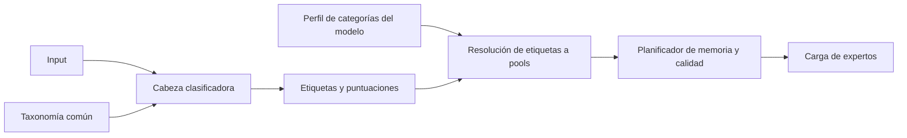

# Vocabulario compartido del categorizador y del modelo

El catálogo `configs/knowledge_v1.json` es una **taxonomía de trabajo**, no una lista completa de todo lo que sabe la humanidad. Define 207 etiquetas: 30 dominios amplios, 176 subcategorías y una etiqueta de abstención (`unknown`). Conserva las 137 categorías del dataset anterior y añade ámbitos que ese dataset no declaraba explícitamente. Los nombres de las categorías finas importadas conservan la terminología inglesa del dataset; sus definiciones necesitan revisión editorial.

## Tres cosas distintas

1. **Vocabulario común**: qué temas podemos nombrar. IDs estables, padres, nombres, descripciones y versión. Es independiente de GPU, checkpoint y número de expertos.
2. **Perfil del modelo**: qué categorías tienen una correspondencia declarada con sus pools. Identifica taxonomía, manifiesto de pools, orden de pools y, al vincularse, checkpoint. Una asignación de entrenamiento no prueba dominio del tema.
3. **Plan de residencia**: qué pools caben en RAM/VRAM bajo una política y un límite de calidad medido. Tener memoria adicional no crea capacidades ni especializaciones nuevas.



El categorizador dinámico comunica sus categorías mediante ese perfil. Puede declarar categorías gruesas o finas usando los mismos IDs. La infraestructura admite ambas; **la elección automática de la granularidad según calidad y hardware sigue pendiente**. Para un modelo ya categorizado durante entrenamiento se utiliza su asignación fija. Para uno categorizado después, habrá que construir las correspondencias a partir de calibración y adaptar sus mapas de expertos al contrato; no se inventan a partir de la taxonomía.

## Cobertura inicial

Los 17 dominios existentes incluyen ciencias físicas y de la vida, matemáticas, informática, IA, ingeniería, medioambiente, medicina, ciencias sociales, derecho, economía, finanzas personales, historia/geografía, artes, filosofía, educación y lenguas.

Se añaden agricultura/alimentación, gastronomía, deporte/ocio, juegos, religión/espiritualidad, oficios/artesanía, hogar, relaciones/cuidados, medios/información, seguridad/emergencias, movilidad/viajes, culturas/saberes locales y ficción/especulación. Las fronteras no son excluyentes: un input puede tener varias etiquetas. Una etiqueta temática no afirma que su contenido sea verdadero, seguro o de calidad.

Las facetas de tarea (explicar, traducir, resolver, crear…) y modalidad (texto, código, imagen…) están separadas. Son descripciones iniciales, **todavía no salidas entrenadas ni capacidades multimodales implementadas**.

## Usar y revisar los manifiestos

```bash
python -m asi taxonomy
python -m asi taxonomy --pool-manifest configs/experiment_124m_v1/expert_pools.json --model-id domain_124m --output results/model_categories_planned.json
```

El segundo comando crea una asignación estática de los 17 dominios originales a los ocho pools existentes. El perfil preparado en `configs/model_categories_124m_v1.json` sirve como ejemplo verificable. Su estado es `planned_unbound`: no autoriza ejecutar ningún checkpoint.

Cuando exista el checkpoint definitivo, generar otro perfil vinculado:

```bash
python -m asi taxonomy --pool-manifest configs/experiment_124m_v1/expert_pools.json --model-id domain_124m --checkpoint results/domain_124m/model_37595.pt --output results/model_categories_trained.json
```

Para probar el contrato sin entrenar ni cargar una LLM, escribir un JSON de puntuaciones como:

```json
{"mathematics_statistics":0.9,"machine_learning_ai":0.8}
```

Y resolverlo:

```bash
python -m asi taxonomy --profile configs/model_categories_124m_v1.json --scores ejemplos_scores.json
```

Resultado esperado: pools `math_physics` y `technology`. Esas puntuaciones son entradas de prueba, no resultados de un clasificador entrenado.

## Resolución y abstención

- Una categoría fina puede resolverse a un ancestro disponible: álgebra → matemáticas → pool del modelo.
- Una categoría demasiado amplia con varias subcategorías disponibles devuelve `needs_refinement`; no selecciona arbitrariamente una subcategoría.
- Cocina no se asigna a salud solo porque no exista un pool culinario. Devuelve `unsupported` si el perfil no declara una correspondencia.
- Ausencia de puntuaciones suficientes o `unknown` produce `uncertain`.
- Mezclar un tema disponible con otro no cubierto produce `partial`. La ejecución adaptativa bloquea ese caso, sin borrar la parte no atendida.
- `dominant_category` informa de la mayor puntuación entre las etiquetas conservadas, pero **no elimina las otras ni demuestra cuál experto responderá mejor**.

Las puntuaciones no se consideran probabilidades calibradas. `--max-depth` permite evaluar una granularidad más gruesa conservando el máximo de las puntuaciones agrupadas; no suma probabilidades ni adapta automáticamente la taxonomía al hardware. Se eliminan etiquetas ancestrales redundantes cuando ya se ha detectado un descendiente.

## Entrenar la cabeza sobre etiquetas comunes

El modo anterior, que predice directamente los ocho pools, sigue disponible. El nuevo modo usa `--taxonomy` y ejemplos etiquetados con IDs del catálogo:

```bash
python -m asi adaptive train-classifier --checkpoint results/domain_124m/model_37595.pt --pool-manifest configs/experiment_124m_v1/expert_pools.json --taxonomy configs/knowledge_v1.json --examples ejemplos_taxonomia.jsonl --output results/semantic_head_v1
```

Cada línea contiene `text` (o `tokens`), `labels` y `split` (`train` o `val`). Usar ejemplos representativos, multietiqueta cuando corresponda, con anotaciones completas y separación por documento entre splits. Para entrenar abstención hacen falta ejemplos etiquetados `unknown`. Al entrenar una categoría hija se añaden sus ancestros a los objetivos; las métricas del informe incluyen esos ancestros.

El informe cuenta ejemplos positivos por etiqueta. El runtime no utiliza salidas que no tuvieron ningún positivo de entrenamiento. **Añadir una categoría al JSON no enseña ese tema al clasificador.** La abstención por umbral tampoco garantiza detectar cualquier tema desconocido; necesita evaluación de inputs fuera de distribución.

La cabeza reutiliza los embeddings congelados y permanece vinculada a ellos. La **taxonomía** puede reutilizarse entre modelos; los **pesos de la cabeza** no son universales. Cambiar de tokenizer/embeddings requiere adaptación o reentrenamiento. El adaptador de ejecución actual es el modelo local ASI, no un loader universal de cualquier LLM.

## Ejecutar con el contrato común

```bash
python -m asi adaptive run --checkpoint results/domain_124m/model_37595.pt --pool-manifest configs/experiment_124m_v1/expert_pools.json --classifier results/semantic_head_v1/head.pt --taxonomy configs/knowledge_v1.json --model-profile results/model_categories_trained.json --prompt "Explain the mathematics of neural networks" --device cuda --warm-mib 64 --output results/semantic_plan.json
```

Sin `--execute` se obtiene el diagnóstico de clasificación y el plan. Añadirlo para ejecutar si la clasificación está cubierta y la memoria/calidad permiten atender todos los pools. La unión sigue siendo uniforme: no se han implementado aquí división de prompts y síntesis de respuestas.

Los IDs no deben reutilizarse con otro significado. Ampliar o reorganizar el catálogo requiere nueva versión y revisión de perfiles/cabezas. La identidad se calcula sobre JSON normalizado, por lo que CRLF/LF y espacios no provocan discrepancias, pero cambiar categorías sí. Los archivos de salida no se sobrescriben.

## Estado de esta entrega

Implementados catálogo, validación jerárquica, perfiles, resolución gruesa/fina, entrenamiento opcional de etiquetas semánticas e integración con el planificador. Probados con fixtures y modelos pequeños. No se ha entrenado un clasificador general ni demostrado cobertura de los 30 dominios. Las recetas y pesos del entrenamiento de 124M no se modifican.
